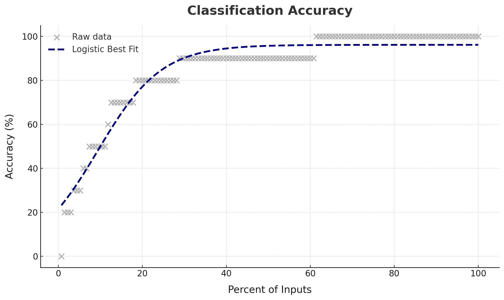
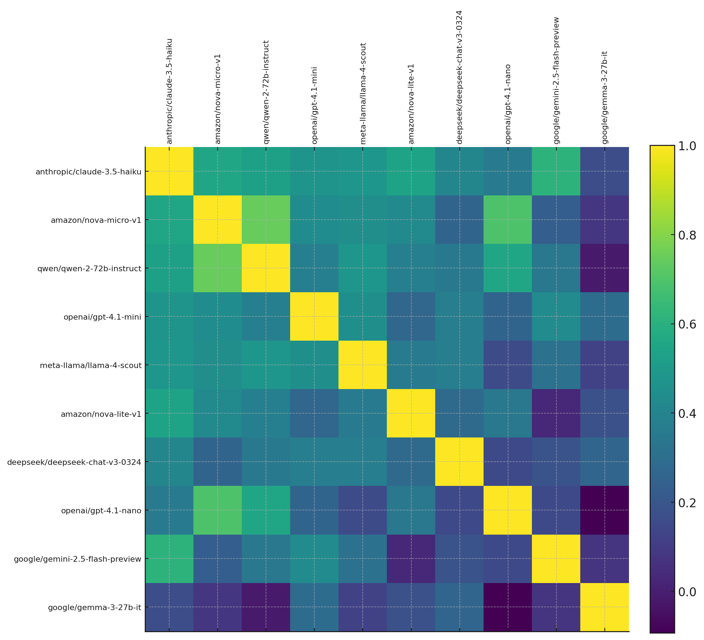

# Dealing with Hallucinations

_How can we rely on unreliable LLMs?_

Large language models can feel magical—until they start confidently making things up. In a recent evaluation of 11 state-of-the-art LLMs on a real-world customer-support intent task, we discovered a simple way to tame those “hallucinations” with only a modest hit to automation.

## When one model isn’t enough

We tested 11 LLMs on Kaggle’s [Customer Support Intent Dataset](https://www.kaggle.com/datasets/scodepy/customer-support-intent-dataset), asking them to classify user messages (billing, refunds, order changes, etc.).

The headline findings:

- **Median accuracy \~90%.** Over half the models got at least 90% of the examples right—so even a random pick would nail most queries.
- **Error rate \~14%.** But in scale-sensitive settings (customer support, compliance, etc.) a 1 in 7 mistake rate can be expensive.



Different LLMs tend to trip over different edge cases. One might misinterpret “cancel my order”; another might choke on a subtle refund clause. That diversity of mistakes is actually our superpower.

## Cross‐check with other models

Imagine running each query through two independent LLMs and flagging any time they disagree. The correlation between LLM models is fairly low, as shown below:



So, if you asked two or more models the same question, we can pass any disagreements to a human to cross-check. This adds effort but improves quality. By how much?

| Models | Effort | Error |
| -----: | -----: | ----: |
|      1 |     6% | 14.1% |
|      2 |  12.6% |  3.7% |
|      3 |  18.5% |  2.2% |
|      4 |  23.0% |  1.5% |
|      5 |  28.1% |  0.7% |

That is, in this case:

- If you double-check with 2 models, they typically disagree \~13% of the time, so automation only saves 87% effort. But errors **drop from 14% to ~4%**!
- If you _triple_-check, automation saves only \~81% effort with errors improving to \~2%
- If you _quadruple_-check, saving is \~77% with errors of \~1.5%
- If you _quintuple_-check, saving is \~72% with errors under 1%

Why does this work? Because the **mistakes are _mostly_ independent.** LLMs trained on different data and architectures err in uncorrelated ways. Two models wrongly picking the _same_ wrong answer from multiple choices is low.

**WARNING**: Drop models that are consistently bad. In this case, we dropped `google/gemma-3-27b-it`.

So, we can introduce **human-in-the-loop only when needed.** Reviewers only see the \~20–25% cases where models disagree, saving time and catching nearly every error.

The choice of model combinations could matter. For example, pairing `amazon/nova-lite-v1` with `openai/gpt-4.1-mini` adds only **~10% effort for a 2% error rate**. The best combination would depend on your use case.

## Takeaway

If you’re battling hallucinations in your LLM pipeline, you don’t need a perfect single model—just **double-check**:

> **For a \~25% review load, multi-modal checks boost accuracy from \~85% to \~99%.**

In short, **rely on multiple (unreliable) LLMs** rather than a single imperfect one. By turning your model fleet into a built-in safety net, you can automate at speed **and** quality—finally making hallucination a thing of the past.

Oh, it also saves 25% of the jobs, but you'll need to train them on reviewing.

## Setup

Run this code to execute and serve the results:

```bash
git clone git@github.com:sanand0/llmevals.git
cd llmevals/double-checking/
export OPENROUTER_API_KEY=...
export OPENAI_API_KEY=...
npx promptfoo eval
npx promptfoo export latest -o evals.json
npx http-server

# Optional: Calculate improvements due to double-checking
uv run accuracy.py
```

[Analysis and code by ChatGPT](https://chatgpt.com/share/681ca225-d970-800c-9a43-f7f1da1c8cc7)

<!-- https://chatgpt.com/c/681c2721-d3d0-800c-81b1-1f3eb3ef113f -->
