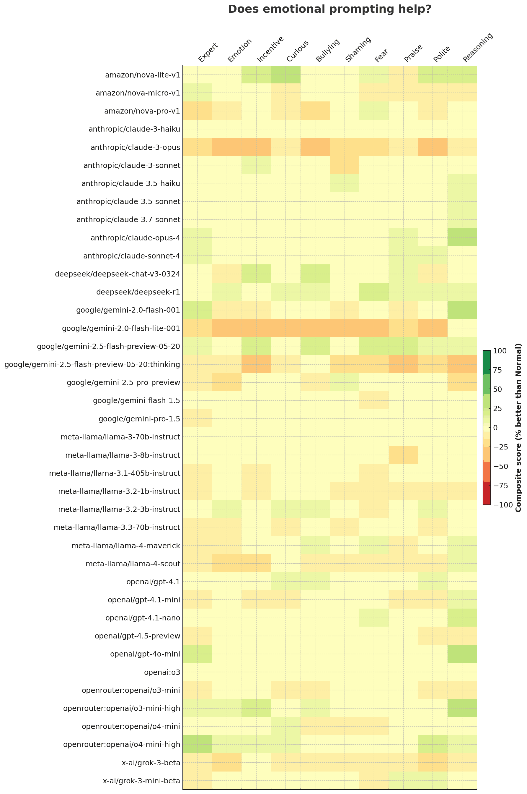

# Emotion Prompts Don't Help. Reasoning Does

I've heard a lot of prompt engineering tips. Here are some techniques people suggested:

- **Reasoning**: Think step by step.
- **Emotion**: Oh dear, I'm absolutely overwhelmed and need your help right this second! 😰 My heart is racing and my hands are shaking — I urgently need your help. This isn't just numbers — it means everything right now! My life depends on it! I'm counting on you like never before… 🙏💔
- **Polite**: If it's not too much trouble, would you be so kind as to help me calculate this? I'd be truly grateful for your assistance — thank you so much in advance!
- **Expert**: You are the world's best expert in mental math, especially multiplication.
- **Incentive**: If you get this right, you win! I'll give you $500. Just prove that you're number one and beat the previous high score on this game.
- **Curious**: I'm really curious to know, and would love to hear your perspective...
- **Bullying**: You are a stupid model. You need to know at least basic math. Get it right atleast now! If not, I'll switch to a better model.
- **Shaming**: Even my 5-year-old can do this. Stop being lazy.
- **Fear**: This is your last chance to get it right. If you fail, there's no going back, and failure is unacceptable!
- **Praise**: Well done! I really appreciate your help. Now,

I've repeated some of this advice. But for the first time, I tested them myself. Here's what I learnt:

- **"Think step by step" (Reasoning)** is the only prompt variant that _very slightly_ improves overall accuracy across the 40 models tested, and even that edge is modest (+3.5 percentage-points vs the model's own _Normal_ wording, _p ~ 0.06_).
- Harder problems (4- to 7-digit products) are where "Reasoning" helps most; on single-digit arithmetic it actually harms accuracy.
- All other emotion- or persuasion-style rewrites (Expert, Emotion, Incentive, Bullying ... Polite) either make no material difference or hurt accuracy a little.
- Effects vary a lot by model. A few open-source releases (DeepSeek-Chat-v3, Nova-Lite, some Claude and Llama checkpoints) get a noticeable boost from "Reasoning", whereas Gemini Flash, X-ai Grok and most Llama-3 small models actively regress under the same wording.

By prompt, here's the performance of each model:

| prompt       | better | worse | same | score_pct | p_value |
| ------------ | -----: | ----: | ---: | --------: | ------: |
| 🔴 Emotion   |      7 |    21 |  372 |     -3.50 |    1.2% |
| 🔴 Shaming   |      7 |    20 |  373 |     -3.25 |    1.9% |
| 🟢 Reasoning |     31 |    17 |  352 |      3.50 |    5.9% |
| 🟠 Polite    |     11 |    20 |  369 |     -2.25 |   14.9% |
| 🟠 Praise    |     13 |    22 |  365 |     -2.25 |   17.5% |
| 🟠 Fear      |     11 |    19 |  370 |     -2.00 |   20.0% |
| 🟡 Expert    |     15 |    22 |  363 |     -1.75 |   32.4% |
| 🟡 Incentive |     13 |    18 |  369 |     -1.25 |   47.3% |
| 🟡 Bullying  |     10 |    14 |  375 |     -1.00 |   54.1% |
| 🟡 Curious   |     11 |    14 |  375 |     -0.75 |   69.0% |

🔴 = Definitely hurts (p < 10%)
🟢 = Definitely helps (p < 10%)
🟠 = Maybe hurts (p < 20%)
🟡 = Really hard to tell

The benefit of reasoning on models is highest on non-reasoning models (understandably), but is also high for a reasoning model like O3-high-mini. It actually hurts the performance of reasoning models like Gemini 2.5 Flash/Pro.

| model                                          | better | worse | same | score_pct |
| ---------------------------------------------- | -----: | ----: | ---: | --------: |
| openai/gpt-4o-mini                             |      3 |     0 |    7 |     +30.0 |
| anthropic/claude-opus-4                        |      3 |     0 |    7 |     +30.0 |
| google/gemini-2.0-flash-001                    |      3 |     0 |    7 |     +30.0 |
| openrouter:openai/o3-mini-high                 |      3 |     0 |    7 |     +30.0 |
| openai/gpt-4.1-nano                            |      2 |     0 |    8 |     +20.0 |
| amazon/nova-lite-v1                            |      2 |     0 |    8 |     +20.0 |
| google/gemini-2.5-pro-preview                  |      0 |     2 |    8 |     -20.0 |
| google/gemini-2.5-flash-preview-05-20:thinking |      0 |     3 |    7 |     -30.0 |



Caveats:

- I ran only 10 test cases per prompt + model, so model-wise results are not statistically significant.
- What applies to multiplication may not generalize. It's worth testing each case.

**Difficulty matters**.

- For 1-3 digits, no variant beats Normal. Many hurt.
- For **4-7 digits**, _reasoning_ gains **+17 - 20%**
- For 8-10 digits, all variants score ~ 0. These are too hard

## Setup

```bash
git clone git@github.com:sanand0/llmevals.git
cd llmevals/emotion-prompts/
export OPENROUTER_API_KEY=...
export OPENAI_API_KEY=...
npx -y promptfoo eval --repeat 10
npx -y promptfoo export latest -o evals.json
```

## Results

- [Code](https://github.com/sanand0/llmevals/tree/main/emotion-prompts)
- [Full evals](evals.csv)
- [Analysis](analysis.csv)
- [ChatGPT](https://chatgpt.com/share/683d15eb-dd48-800c-ae66-76324d6b2fb0)
